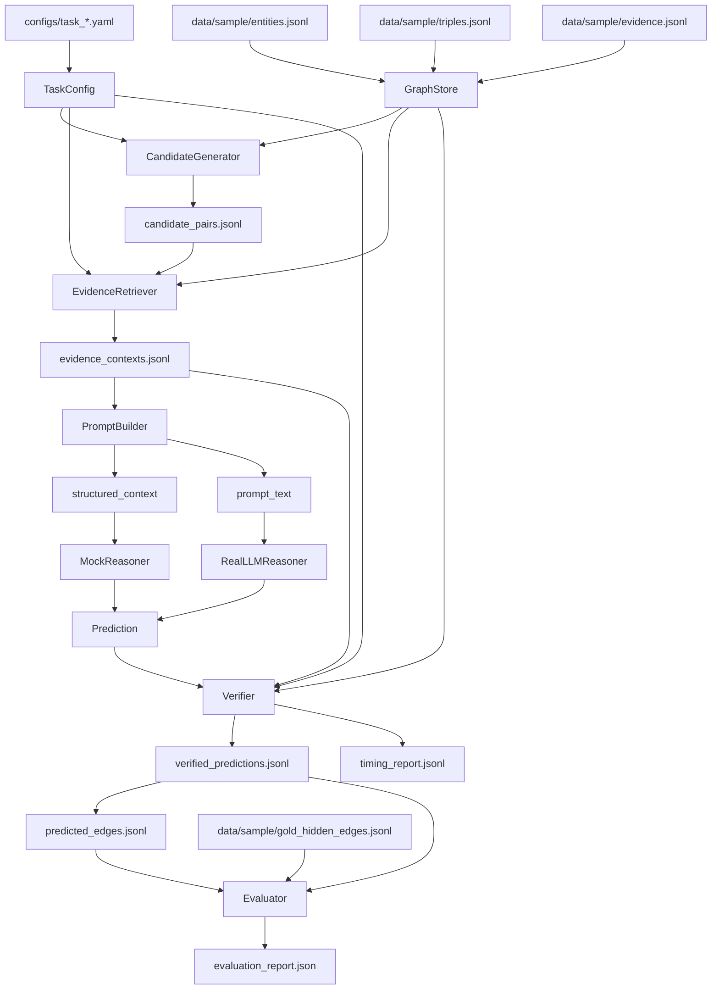

# 代码实现走读

这份文档从命令行入口开始，按真实调用顺序说明 EvidenceKG-Reasoner 如何完成一次 KG 候选关系推理。当前项目主链路是：

```text
JSONL KG 加载
-> schema filter 与候选关系生成
-> 图证据检索
-> PromptBuilder 构造 structured_context / prompt_text
-> MockReasoner 或 RealLLMReasoner 推断
-> Verifier 审查
-> predicted_edges 输出
-> hidden edge recovery 评测
```

## 1. 项目目录结构

```text
EvidenceKG-Reasoner/
  configs/
    task_owned_by.yaml
    task_owned_by_real.yaml
    task_owned_by_entity_text_only.yaml
    task_owned_by_evidence_only.yaml
    task_owned_by_structure_only.yaml
  data/sample/
    entities.jsonl
    triples.jsonl
    evidence.jsonl
    gold_hidden_edges.jsonl
  scripts/
    run_pipeline.py
    run_evaluation.py
  src/evidencekg/
    config/task_config.py
    graph/graph_store.py
    candidate/generator.py
    retrieval/evidence_retriever.py
    prompting/prompt_builder.py
    llm/reasoner.py
    llm/openai_compatible_client.py
    verify/verifier.py
    eval/evaluator.py
    pipeline/runner.py
    io.py
  tests/
  docs/
```

`configs/` 控制任务、候选规则、证据检索范围、LLM 模式和 Verifier 策略。`data/sample/` 是本地样例 KG。`scripts/run_pipeline.py` 是主入口。`src/evidencekg/` 是实现主体。`docs/` 保存规划、实验结果和本次代码讲解文档。

## 2. 从 run_pipeline.py 开始

入口文件是 `scripts/run_pipeline.py`。它做三件事：

1. 把项目根目录下的 `src/` 加到 `sys.path`。
2. 用 `argparse` 读取命令行参数。
3. 调用 `PipelineRunner().run(...)` 并打印返回的 `evaluation_report`。

关键参数：

- `--config`：任务配置文件，例如 `configs/task_owned_by.yaml` 或 `configs/task_owned_by_real.yaml`。
- `--data-dir`：输入数据目录，例如 `data/sample`。
- `--output-dir`：输出目录。
- `--stage candidates`：只生成候选，不进入证据检索和推理。
- `--max-candidates`：只限制进入证据检索、reasoning、Verifier、Evaluator 的候选数，不影响完整候选生成。
- `--candidate-offset`：跳过前 N 个候选后再配合 `--max-candidates` 截取窗口。
- `--disable-verifier`：仅用于 ablation，跳过 Verifier。
- `--debug-timing`：打印详细 timing 日志，并写 `timing_report.jsonl`。
- `--llm-timeout-seconds`：临时覆盖 real LLM timeout，`0` 表示不设置 HTTP timeout。
- `--llm-max-retries`：临时覆盖重试次数，`0` 表示只请求一次。

## 3. PipelineRunner.run() 执行顺序

`src/evidencekg/pipeline/runner.py` 中的 `PipelineRunner.run()` 是主编排函数，真实顺序如下：

1. `load_task_config(config_path)` 读取 YAML，构造 `TaskConfig`。
2. 如果 CLI 指定 `llm_timeout_seconds` 或 `llm_max_retries`，用 `dataclasses.replace` 临时覆盖 `config.llm`。
3. `GraphStore.from_dir(data_dir)` 加载 entities、evidence、triples。
4. `CandidateGenerator().generate(config, graph)` 生成完整候选。
5. 写出完整 `candidate_pairs.jsonl`。
6. 如果 `stage == "candidates"`，提前返回。
7. 根据 `candidate_offset` 和 `max_candidates` 得到本次进入 reasoning 的候选窗口。
8. 写 `run_metadata.json`，并检查是否可 resume。
9. `EvidenceRetriever().retrieve(...)` 为每个 reasoning candidate 构造 evidence context。
10. 写出 `evidence_contexts.jsonl`。
11. 用 `PromptBuilder().build(...)` 为每个 context 构造 `structured_context` 和 `prompt_text`。
12. 根据 `config.llm.mode` 选择 `MockReasoner` 或 `RealLLMReasoner`。
13. reasoner 输出 `decision/confidence/reason/supporting_evidence_ids`。
14. 默认经过 `Verifier.verify(...)`；如果 `--disable-verifier` 则走 `_raw_prediction(...)`。
15. 每个 candidate 完成后增量 append 到 `verified_predictions.jsonl`。
16. `--debug-timing` 开启时，每个 candidate 完成后增量 append 到 `timing_report.jsonl`。
17. 全部完成后重写 `verified_predictions.jsonl`，生成只含最终通过边的 `predicted_edges.jsonl`。
18. `Evaluator().evaluate(...)` 计算 hidden edge recovery 指标。
19. 写出 `evaluation_report.json`。

## 4. 每一步的输入、模块和输出

| 步骤 | 输入 | 调用模块 | 输出 |
| --- | --- | --- | --- |
| 加载配置 | YAML config | `load_task_config` | `TaskConfig` |
| 加载 KG | `entities.jsonl`、`triples.jsonl`、`evidence.jsonl` | `GraphStore.from_dir` | 内存 KG 和 `MultiDiGraph` 索引 |
| 生成候选 | `TaskConfig`、`GraphStore` | `CandidateGenerator.generate` | `candidate_pairs.jsonl` |
| 证据检索 | candidate、config、graph | `EvidenceRetriever.retrieve` | `evidence_contexts.jsonl` |
| 构造 prompt | evidence context | `PromptBuilder.build` | `structured_context`、`prompt_text` |
| 推断 | context / prompt | `MockReasoner` 或 `RealLLMReasoner` | prediction |
| 审查 | candidate、context、prediction | `Verifier.verify` | `verified_predictions.jsonl` |
| 最终边输出 | verified predictions | `PipelineRunner` filter | `predicted_edges.jsonl` |
| 评测 | predicted、verified、gold | `Evaluator.evaluate` | `evaluation_report.json` |

## 5. mock mode 与 real mode 的区别

两种模式共享 GraphStore、CandidateGenerator、EvidenceRetriever、PromptBuilder、Verifier、Evaluator。区别只发生在 reasoner：

- mock mode：`config.llm.mode == "mock"`，`PipelineRunner._build_reasoner()` 返回 `MockReasoner()`。
- real mode：`config.llm.mode == "real"`，返回 `RealLLMReasoner(config.llm, debug_timing=...)`。

`MockReasoner` 只消费 `structured_context`，不解析自然语言 prompt。它用 evidence、graph_paths、common_neighbors、candidate_score 规则化地产生 `accept/reject/uncertain`。

`RealLLMReasoner` 使用 `PromptBuilder.prompt_text` 调用 OpenAI-compatible provider。它要求模型返回 JSON，然后进行解析、规范化、异常降级。无论 mock 还是 real，输出都必须再经过 Verifier 才能进入 `predicted_edges.jsonl`。

## 6. 参数如何影响运行

`--max-candidates` 不影响候选生成，只影响进入证据检索和 reasoning 的候选数量。因此 `candidate_pairs.jsonl` 仍是完整候选集，小规模 run 的 recall 不能和 full run 直接比较。

`--candidate-offset` 在完整候选排序后跳过前 N 个候选，再应用 `--max-candidates`。例如 offset 40、max 10 表示观察第 41 到第 50 个候选。

`--debug-timing` 会打印阶段耗时、real LLM candidate 级日志、provider heartbeat，并写 `timing_report.jsonl`。它不改变推理语义。

`--llm-timeout-seconds` 只覆盖本次运行的 `config.llm.timeout_seconds`。传 `0` 时 `OpenAICompatibleClient` 使用 `httpx.Client(timeout=None)`，适合测模型自然返回耗时。

`--llm-max-retries` 只覆盖本次运行的 `config.llm.max_retries`。传 `0` 表示只发一次请求，不重试。

## 7. 数据流向图


